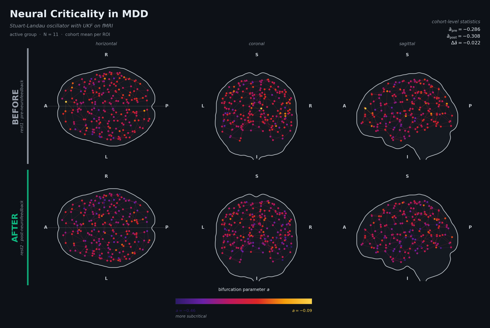

<div align="center">

<picture>
  <source media="(prefers-color-scheme: dark)" srcset="assets/hero_mdd.png">
  
</picture>

# Neural Criticality in Major Depressive Disorder

### Real-Time fMRI Neurofeedback & Stuart-Landau Whole-Brain Dynamics

[](https://www.r-project.org/)
[](https://www.python.org/)
[]()
[]()
[]()
[]()
[]()

---

*Can targeted neurofeedback reorganize the spatial distribution of the depressed brain's distance from criticality?*

</div>

---

## Overview

This repository contains the full analysis pipeline for a double-blind, sham-controlled real-time fMRI neurofeedback trial in unmedicated Major Depressive Disorder. The central scientific question is whether MDD resting-state brain dynamics occupy a subcritical regime, and whether amygdala-targeted neurofeedback measurably reorganizes that regime.

A **Stuart-Landau oscillator**, the canonical normal form of a supercritical Hopf bifurcation, is fitted to each region's BOLD time series via an **Unscented Kalman Filter**, yielding a per-region per-session bifurcation parameter $a$ that quantifies the distance from the critical boundary between noise-driven and self-sustaining oscillatory dynamics. The principal substrate of inference is not the cohort-level mean alone but the **spatial heterogeneity of $a$ across cortex**, captured by the across-region standard deviation $\sigma_a$ — a quantity that distinguishes uniform from focal perturbations of the cortical dynamical landscape and that mean-based statistics cannot register.

The framework draws conceptually on the cortical hierarchy literature (intrinsic neural timescales, regional E/I balance) and the broader Hopf-bifurcation modeling tradition for whole-brain dynamics. The empirical contribution is to demonstrate that the spatial distribution of the bifurcation parameter is sensitive to within-cohort therapeutic intervention at a sample size where the cohort-level mean alone is not.

---

## Study Design

<table>
<tr>
<td width="50%">

**Participants**
- Unmedicated MDD (DSM-IV-TR criteria)
- 23 enrolled → 19 paired for analysis
- 2 excluded (excessive head motion)
- 2 excluded (single-session only)
- Active *n* = 11; sham *n* = 8

**Neurofeedback Protocol**
- Active: left amygdala upregulation
- Sham: left intraparietal sulcus (control)
- Double-blind, randomized assignment
- Resting-state fMRI as primary substrate (pre-NF and post-NF)

</td>
<td width="50%">

**Acquisition**
- Siemens 3T scanner
- TR = 2.0 s; 260 volumes per session
- AFNI preprocessing (motion, nuisance, bandpass 0.01–0.10 Hz)
- Input: AFNI `errts` residuals

**Parcellation**
- Primary: Schaefer-200 (cortex) + Melbourne Tian-16 (subcortical) = 216 ROIs
- Validation: Harvard-Oxford 110-ROI sphere-based, fully independent
- Cross-atlas reproduction: *r* = 0.881

</td>
</tr>
</table>

---

## Pipeline Architecture

```
┌──────────────────────────────────────────────────────────────────────────┐
│                       parcellate_219roi_v3.ipynb                         │
│   AFNI BRIK/HEAD  ──▸  Atlas construction (216 + 110)  ──▸  ROI CSVs     │
└───────────────────────────────────┬──────────────────────────────────────┘
                                    │
                                    ▼
┌──────────────────────────────────────────────────────────────────────────┐
│                          mdd_analysis_v3.ipynb                           │
│                                                                          │
│  ┌──────────────────────┐    ┌──────────────────────────────────────┐    │
│  │  Stage 1 — SL-UKF    │    │  Stage 1b — L-BFGS-B (deterministic) │    │
│  │  per-region a, ω     │    │  estimator-comparison robustness     │    │
│  └──────────┬───────────┘    └──────────────────────────────────────┘    │
│             │                                                            │
│             ▼                                                            │
│  ┌─────────────────────────────────────────────────────────────────┐     │
│  │           Per-region per-session bifurcation parameters         │     │
│  └────────────────────────────┬────────────────────────────────────┘     │
│                               │                                          │
│         ┌─────────────────────┼─────────────────────┐                    │
│         ▼                     ▼                     ▼                    │
│   ┌──────────┐         ┌─────────────┐      ┌──────────────────┐         │
│   │  H1      │         │  H2         │      │  H3              │         │
│   │  cohort  │         │  Δa group   │      │  Δσ_a group      │         │
│   │  subcrit │         │  contrast   │      │  contrast        │         │
│   └──────────┘         └─────────────┘      └──────────────────┘         │
│                                                                          │
│  ┌─────────────────────────────────────────────────────────────────┐     │
│  │  Sensitivity battery: power · half-width stratification ·       │     │
│  │  cross-atlas · estimator · session-order · ICC · baseline       │     │
│  │  characterization · demographic adjustment · circuit-size       │     │
│  └─────────────────────────────────────────────────────────────────┘     │
└──────────────────────────────────────────────────────────────────────────┘
```

---

## The Stuart-Landau Model

The Stuart-Landau equation in complex form:

$$
\dot{z} \;=\; (a + i\omega)\,z \;-\; |z|^2\,z \;+\; \sigma\,\eta(t)
$$

Expanded to real coordinates for the UKF state space:

$$
\dot{x} \;=\; a\,x - \omega\,y - (x^2 + y^2)\,x
$$

$$
\dot{y} \;=\; \omega\,x + a\,y - (x^2 + y^2)\,y
$$

where $z = x + iy$ is the analytic signal (BOLD with Hilbert transform), $a$ is the bifurcation parameter, $\omega$ is the natural angular frequency, $\sigma$ scales the additive noise process, and $\eta(t)$ is complex-valued Gaussian noise of unit intensity.

When $a < 0$, perturbations from the fixed point at the origin decay exponentially with characteristic timescale $\tau = 1/|a|$. When $a > 0$, the system enters a stable limit cycle with amplitude $\sqrt{a}$ and frequency $\omega$. The bifurcation parameter therefore encodes, in a single scalar, the local dynamical regime of the region.

| Parameter | Meaning | Status |
|-----------|---------|--------|
| $a$ | Distance from critical point | Estimated by UKF (Stage 1) |
| $\omega$ | Natural oscillation frequency | Pre-fitted via Hilbert phase derivative |
| $\sigma_a$ | Across-region SD of *a* per subject | Statistical Analysis (H3) |
| $K$ | Inter-regional coupling | Tested → not identifiable at TR = 2 s |

The decision to fix $\omega$ before fitting $a$ avoids the joint identifiability problem that arises when both parameters are inferred from a single short BOLD recording. The decision to anchor substantive claims to cohort-level statistics, circuit-level patterns, and the second-moment statistic $\sigma_a$ deliberately sidesteps the per-fit identifiability constraints documented in the supplementary materials.

---

## Pre-Specified Hypotheses

| | Hypothesis | Test |
|---|------------|------|
| **H1** | The MDD cohort sits in the subcritical regime: cohort-mean $a < 0$ | One-sample $t$-test on subject-level mean (38 observations from 19 subjects × 2 sessions) |
| **H2** | Active rtfMRI-NF produces a directional shift in mean $a$ relative to sham, both whole-brain and within a depression-relevant circuit | Welch's $t$-test on per-subject $\Delta a$ |
| **H3** | Active rtfMRI-NF produces a reorganization of the spatial distribution of regional bifurcation states relative to sham | Welch's $t$-test on per-subject $\Delta \sigma_a$ |

Inferential controls applied to all three families: Cohen's $d$ effect sizes with pooled SD, Mann-Whitney $U$ as non-parametric confirmation, BCa bootstrap 95% CIs (10,000 resamples), Benjamini-Hochberg FDR across hypothesis families.

---

## Principal Findings

**Cohort-level subcriticality (H1)** is robust and replicates on the cross-validation atlas:

```
H1: cohort subcriticality (216-ROI)        t(37) = -56.13     p < 0.001     CONFIRMED
H1: cohort subcriticality (HOA-110)        t(37) = -56.29     p < 0.001     REPLICATED
```

**Directional H2 contrast** is consistent across the whole-brain and circuit-restricted analyses, with both contrasts pointing toward deeper subcriticality in the active arm relative to sham. Both fall below the design's minimum detectable effect at conventional 80% power and are interpreted as power-limited rather than evidentially decisive:

```
H2: whole-brain Δa           d = -0.84    p = 0.080     directional, power-limited
H2: circuit-restricted Δa    d = -0.66    p = 0.157     directional, not significant
```

**Spatial reorganization (H3)** reaches conventional significance and is the centerpiece finding of the analysis:

```
H3: Δσ_a                     d = +0.96    p = 0.050     SIGNIFICANT
```

Active-group regions diverge in their dynamical operating points across cortex while sham-group regions converge — a pattern that the cohort-level mean is unable to register because it averages over the spatial structure that $\sigma_a$ summarizes.

---

## Methodological Highlights

**Spatial heterogeneity statistic.** The across-region standard deviation $\sigma_a$ is introduced as a second-moment summary of the per-region bifurcation parameter distribution. Theoretical motivation: a uniform perturbation of all regions shifts the cohort mean but leaves $\sigma_a$ approximately unchanged; a focal perturbation that engages a circumscribed circuit expands $\sigma_a$ even when the resulting shift in cohort mean is modest. The two regimes are dissociable through $\sigma_a$ but not through $\bar{a}$ alone.

**Stuart-Landau UKF.** RK4-integrated sigma-point Kalman filter for joint state-parameter estimation from the BOLD analytic signal, with $\omega$ pre-fitted via a trimmed-median Hilbert phase-derivative procedure. The fixed-$\omega$ variant resolves the $a$–$\omega$ identifiability trade-off that arises when both parameters are estimated jointly from short recordings.

**Dual-atlas validation.** Every subject-level result is independently replicated on a second atlas (216-ROI Schaefer-Melbourne primary; 110-ROI Harvard-Oxford sphere-based validation) with no shared ROIs and independent processing pipelines. Cross-atlas correlation $r = 0.881$ on per-subject $\Delta a$.

**Dual-estimator robustness.** A complementary deterministic-objective estimator using multi-start L-BFGS-B optimization of the chi-square surface with a per-fit observability metric is applied to the same data. Cohort-level mean direction and magnitude agree closely; per-fit estimates diverge substantially, with Pearson correlation near zero between per-region per-session estimates from the two pipelines. The substantive findings of the present analysis rest on cohort-level and second-moment statistics that are preserved across the two estimation frameworks.

**Power calibration upfront.** A sensitivity power analysis was conducted before the H2 analysis was performed. Under the empirical group variances and sample sizes, the minimum detectable effect at 80% power is $|d| \approx 1.4$, and the H2 contrast is interpreted throughout under this power-bounded reading.

**A priori depression-circuit mask.** The 69-ROI depression circuit used in the circuit-restricted H2 analysis is constructed in this work as a literature-based mask on the Schaefer-Melbourne atlas — a fixed list of subcortical parcels and a fixed set of substring patterns matched against Schaefer parcel names, applied identically to all subjects before any group-level analysis is conducted. The mask is intended to be carried forward as a reusable definition in subsequent analyses on related cohorts.

**Linearization coherence.** In the deeply subcritical regime confirmed by H1, the Stuart-Landau cubic term vanishes and the model reduces to multivariate Ornstein-Uhlenbeck. The mOU framework is therefore not an independent model choice but the linearization of the SL dynamics under the empirical regime characterized by Stage 1.

---

## Sensitivity Analyses

A battery of robustness checks supports the principal findings against the major threats to inference at the present sample size.

| Check | Substrate | Verdict |
|-------|-----------|---------|
| Power calibration | Welch noncentrality under empirical variances | Minimum detectable $|d| \approx 1.4$ at 80% power |
| Half-width stratification | UKF posterior half-width filter | H1, H2, H3 directions stable or strengthen as threshold tightens |
| Cross-atlas reproduction | Harvard-Oxford 110-ROI | All three hypotheses preserve direction and approximate magnitude |
| Estimator comparison | UKF vs deterministic L-BFGS-B | Cohort-level and second-moment findings agree |
| Session-order check | Sham-arm one-sample tests vs zero | No detectable rest1→rest2 drift in either Δ$a$ or Δσ$_a$ |
| Test-retest reliability | ICC(2,1) on sham arm | Subject-level statistics moderately reliable; per-region values lower (per-fit identifiability) |
| Baseline characterization | Group × baseline interaction | Baseline predicts Δ (regression to the mean); interaction non-significant |
| Demographic adjustment | Age + sex covariates | H2 and H3 contrasts preserved in direction and magnitude |
| Circuit-size sensitivity | Eight circuit variants (8 → 77 ROIs) | Direction preserved; $|d|$ varies smoothly between 0.55 and 0.75 |

---

## Requirements

<table>
<tr>
<td>

**R packages**
```
pracma, MASS, Matrix, dplyr,
tidyr, ggplot2, scales, glmnet,
igraph, parallel, zoo, KernSmooth,
gridExtra, cowplot, patchwork
```

</td>
<td>

**Python packages**
```
nibabel, nilearn, numpy,
pandas, scipy, tqdm
```

</td>
</tr>
</table>

**System:** R ≥ 4.2 · Python ≥ 3.9 · AFNI (preprocessing only)
**Hardware target:** Apple Silicon (M-series) with 64 GB RAM; 8 logical cores recommended for PSOCK parallelization
**Total runtime:** ≈ 5 hours end-to-end on the recommended hardware

---

## Quick Start

```bash
# 1. Clone and set up
git clone <repository-url>
cd <repository-root>

# 2. Place source data
#    data/source/processed rest scans/    (rest1 BRIK/HEAD)
#    data/source/processed rest2 scans/   (rest2 BRIK/HEAD)
#    data/source/participants.tsv         (group assignments + clinical scales)
#    atlases/Tian_Subcortex_S1_3T_2009cAsym.nii.gz

# 3. Run parcellation (~20 min)
jupyter execute parcellate_219roi_v3.ipynb

# 4. Run main analysis (~5 hours; 3 h per atlas + ~2 h hypothesis tests)
jupyter execute mdd_analysis_v3.ipynb

# 5. Generate revisions outputs (figR1–R6, supplementary tables)
jupyter execute ch4_revisions_outputs.ipynb

# Results → results/v3/
```

---

## Data Source and Provenance

Resting-state fMRI data were collected at the **Laureate Institute for Brain Research** (LIBR, Tulsa, Oklahoma) under the rtfMRI-NF clinical trial **NCT02079610**. Acquisition and preprocessing protocols follow the Zotev/Young series of publications on amygdala-targeted neurofeedback in MDD (Zotev et al. 2016; Young et al. 2014, 2017, 2018). All procedures were approved by the Western Institutional Review Board, with informed consent obtained from all participants. Group assignments used in the present analyses are read from the authoritative `participants.tsv` study record.

The present work is an independent secondary analysis of the resting-state component of the trial, applying a Stuart-Landau bifurcation-parameter framework that is not present in the original publications. All raw imaging data, preprocessing, and group assignments derive from the LIBR cohort; all dynamical-systems modeling, $\sigma_a$ analyses, and methodological developments documented here are contributions of the present work.

---

## Citation

If you use this pipeline or build on this work, please cite the accompanying manuscript (citation block to be filled upon publication) and acknowledge the upstream data-source publications:

- Zotev, V. et al. (2016). Correlation between amygdala BOLD activity and frontal EEG asymmetry during real-time fMRI neurofeedback training in patients with depression. *NeuroImage: Clinical*, 11, 224–238.
- Young, K. D. et al. (2014). Real-time fMRI neurofeedback training of amygdala activity in patients with major depressive disorder. *PLOS ONE*, 9(2), e88785.
- Young, K. D. et al. (2017). Randomized clinical trial of real-time fMRI amygdala neurofeedback for major depressive disorder. *American Journal of Psychiatry*, 174(8), 748–755.

---

<div align="center">

*Built on the [Stuart-Landau](https://en.wikipedia.org/wiki/Stuart%E2%80%93Landau_equation) normal form · [Unscented Kalman Filter](https://github.com/insilico/UKF) · [Schaefer 2018](https://github.com/ThomasYeoLab/CBIG/tree/master/stable_projects/brain_parcellation/Schaefer2018_LocalGlobal) + [Melbourne Subcortex](https://github.com/yetianmed/subcortex) parcellations*

</div>
